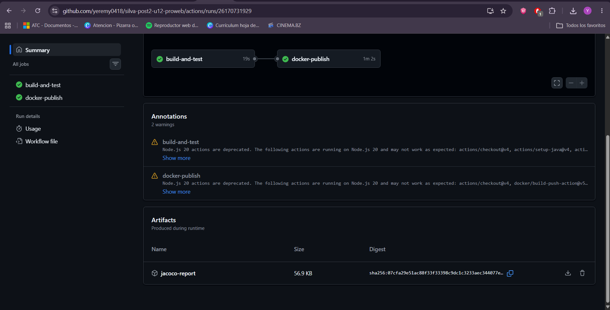
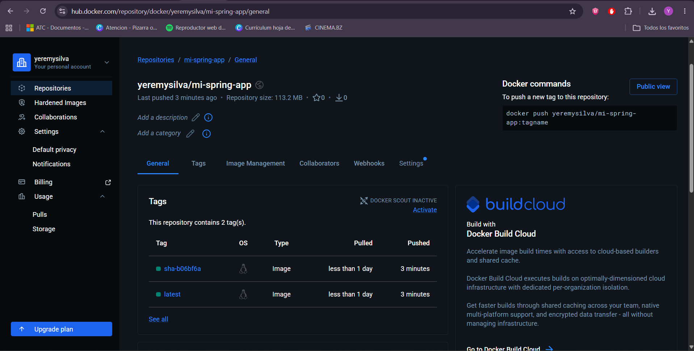

# Productos Web


CRUD de productos con Spring Boot y Thymeleaf.

## Descripción

Aplicación web para la gestión de productos con operaciones CRUD. Desarrollada con Spring Boot 3.5.0, Thymeleaf, JPA y PostgreSQL como parte del curso de Programación Web — Universidad.

## Pipeline CI/CD

El pipeline se activa automáticamente en cada push a `main` y realiza:

1. **Compilación** con Maven y ejecución de pruebas unitarias
2. **Generación** de reporte de cobertura JaCoCo (disponible como artefacto descargable)
3. **Construcción** de imagen Docker con multi-stage build
4. **Publicación** de la imagen en Docker Hub con tags `latest` y `sha-<commit>`

### Jobs del pipeline

| Job | Descripción |
|-----|-------------|
| `build-and-test` | Compila el proyecto, ejecuta pruebas y publica reporte JaCoCo |
| `docker-publish` | Construye y publica la imagen Docker en Docker Hub (solo en push a `main`) |

## GitHub Secrets requeridos

Configurar en **Settings → Secrets and variables → Actions** del repositorio:

| Secret | Descripción |
|--------|-------------|
| `DOCKERHUB_USERNAME` | Nombre de usuario de Docker Hub |
| `DOCKERHUB_TOKEN` | Access Token generado en Docker Hub (Account Settings → Security → New Access Token) |

> **Nota:** No usar la contraseña de Docker Hub directamente. Generar un Access Token con permisos de lectura y escritura.

## Imagen Docker

```bash
docker pull yeremysilva/mi-spring-app:latest
docker run -p 8080:8080 -e SPRING_PROFILES_ACTIVE=dev yeremysilva/mi-spring-app:latest
```

## Evidencias

### Historial de GitHub Actions



### Imagen publicada en Docker Hub



## Tecnologías

- Java 17
- Spring Boot 3.5.0
- Thymeleaf
- Spring Data JPA
- PostgreSQL
- Docker (multi-stage build)
- GitHub Actions (CI/CD)
- JaCoCo (cobertura de pruebas)
